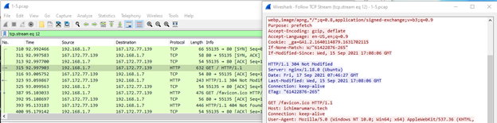
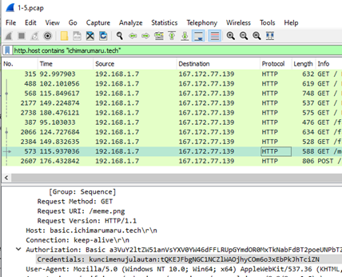

# Jarkom-Modul-1-T10-2021

PRAKTIKUM MODUL 1 JARINGAN KOMPUTER 2021

Anggota Kelompok IT07: 
Tri Rizki Yuliawan (05311940000024)  
Kevin Nathaniel (05311940000032)  
I Gde Ardha Semaranatha Gunasatwika (05311940000034)  

# Soal 

### 1. Sebutkan webserver yang digunakan pada "ichimarumaru.tech"!

Pencarian web server dilakukan dengan display filter `http.host contains "ichimarumaru.tech"`

Kemudian Follow TCP stream, maka kita bisa melihat web server yang digunakan, maka bisa dilihat web servernya adalah nginx/1.18.0 (Ubuntu)

### 2.Temukan paket dari web-web yang menggunakan basic authentication method!

Untuk filter website yang menggunakan basic authentication menggunakan command `http.authbasic` pada display filter

### 3.Ikuti perintah di basic.ichimarumaru.tech! Username dan password bisa didapatkan dari file .pcapng!

Untuk mengetahui username dan password saat memasuki site maka kita akan mencarinya dengan display filter menggunakan command `http.host contains “ichimarumaru.tech`

Dari snapshot tersebut bisa dilihat credentialnya yaitu :
Username : kuncimenujulautan
Pwd : tQKEJFbgNGC1NCZlWAOjhyCOm6o3xEbPkJhTciZN
Jawaban pertanyaan : Putih hijau - Hijau - Putih Orange - Biru - Putih biru - orange - putih coklat - coklat

### 4.Temukan paket mysql yang mengandung perintah query select!

Melakukan display filter `Frame matches “SELECT”` dan akan didapatkan hasil sebagai berikut

### 5.Login ke portal.ichimarumaru.tech kemudian ikuti perintahnya! Username dan password bisa didapat dari query insert pada table users dari file .pcap!

Untuk mendapatkan username dan password, digunakan display filter `mysql`. Karena data yang didapat sedikit, kami mengecek secara manual dan didapatkan sebagai berikut,

Lalu, terdapat soal sebagai berikut,

### 6.Cari username dan password ketika melakukan login ke FTP Server!

Untuk mendapatkan username dan password, kami menggunakan display filter “ftp” dan didapatkan username : secretuser dan password :  aku.pengen.pw.aja

### 7.Ada 500 file zip yang disimpan ke FTP Server dengan nama 0.zip, 1.zip, 2.zip, ..., 499.zip. Simpan dan Buka file pdf tersebut. (Hint = nama pdf-nya "Real.pdf")

Pertama menggunakan filter command tcp contains “Real.pdf” untuk mencari file pdf yang diinginkan. Kemudian untuk download file tersebut, klik kanan, Follow > TCP Stream, kemudian pada “Show data as” kita pilih Raw lalu Save as, nama zip tersebut aku simpan dalam hasil.zip

### 8.Cari paket yang menunjukan pengambilan file dari FTP tersebut!

Menggunakan display filter “ftp.request == RETR” dan tidak didapatkan hasil apa-apa sehingga disimpulkan tidak ada file yang di-download

### 9.Dari paket-paket yang menuju FTP terdapat inidikasi penyimpanan beberapa file. Salah satunya adalah sebuah file berisi data rahasia dengan nama "secret.zip". Simpan dan buka file tersebut!

Langkah pertama adalah mencari file dengan display filter “ftp-data”, kemudian akan muncul file secret.zip. 

Klik kanan dan follow TCP stream , kemudian simpan file sebagai raw dengan nama “secret.zip” dan file akan muncul dengan nama secret extensi .zip dan buka file tersebut, dimana terdapat file wanted.pdf didalamnya

### 10.Selain itu terdapat "history.txt" yang kemungkinan berisi history bash server tersebut! Gunakan isi dari "history.txt" untuk menemukan password untuk membuka file rahasia yang ada di "secret.zip"!

Untuk mencari history.txt, kami menggunakan display filter “ftp-data” dan mencari info history.txt

Lalu dilakukan follow -> TCP stream pada data

Didapatkan hasil sebagai berikut, yang dimana menjelaskan bahwa password dari wanted.pdf adalah baris terakhir dari bukanapaapa.txt. Selanjutnya kami mencari info bukanapaapa.txt

Lalu dilakukan follow -> TCP stream pada data

Didapatkan text sebagai berikut, “d1b1langbukanapaapajugagapercaya”. Kami menggunakan text tersebut sebagai password dari wanted.pdf. Didapatkan hasil wanted.pdf sebagai berikut,

### 11. Filter sehingga wireshark hanya mengambil paket yang berasal dari port 80!

Kita dapat menggunakan filter command : `src port 80`

### 12. Filter sehingga wireshark hanya mengambil paket yang mengandung port 21!

Kita dapat menggunakan filter command: `port 21`

Tidak terdapat lalu lintas data karena port 21 biasanya hanya digunakan pada saat mengakses FTP Server dan pada saat itu saya tidak mengakses FTP server sehingga tidak ada lalu lintas data.

### 13. Filter sehingga wireshark hanya menampilkan paket yang menuju port 443!

Kita dapat menggunakan filter command: `dst port 443`

### 14. Filter sehingga wireshark hanya mengambil paket yang tujuannya ke kemenag.go.id!

Untuk mengambil paket yang tujuannya ke kemenag.go.id, kita bisa menggunakan capture filter `dst host kemenag.go.id`

### 15. Filter sehingga wireshark hanya mengambil paket yang berasal dari ip kalian!

Untuk mencari ip, kami menggunakan command prompt, kemudian mengetikkan command ipconfig. Dari situ, kami menemukan bahwa ip kami adalah 192.168.43.13

Sehingga untuk mengambil paket yang berasal dari ip kami, dapat menggunakan capture filter: `ip src 192.168.43.13`

